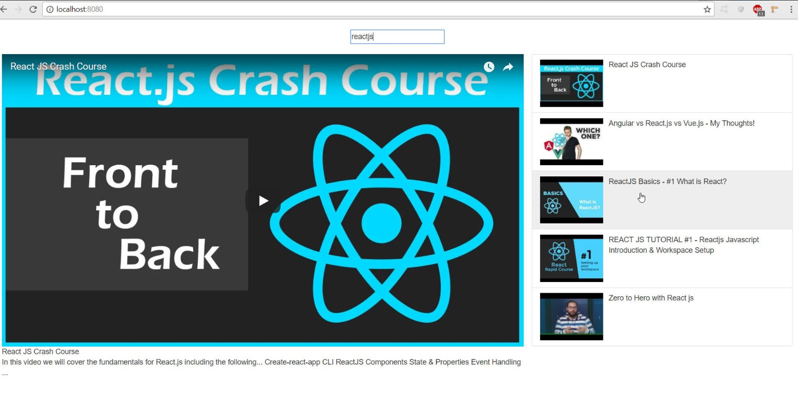

## **ReactJS Youtube Application** ##



#### *App Info*

Using Youtube API, I made a simple React app that allows users to search for Youtube videos and get list of related videos as a response.

#### *Quick Start*

``` bash
# Install dependencies
npm install

# Serve on localhost:8080
npm start

# Build for production
npm run build
``` 